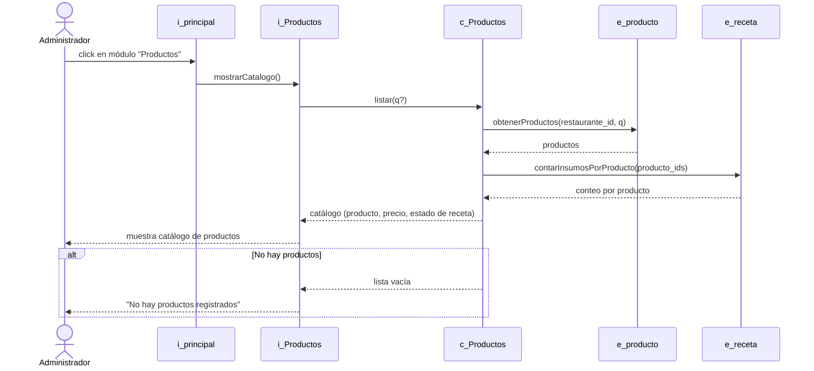
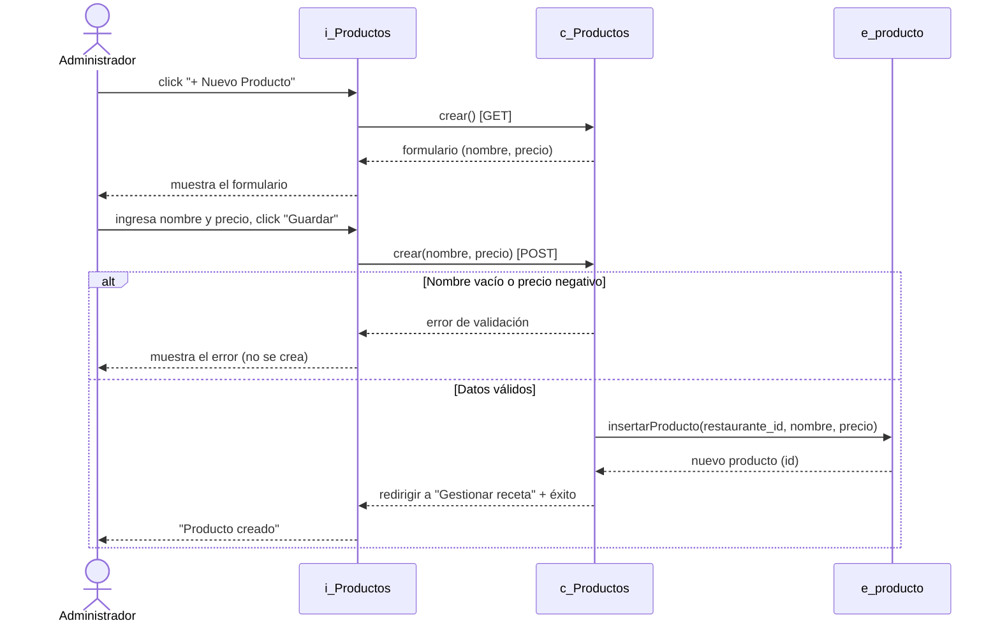
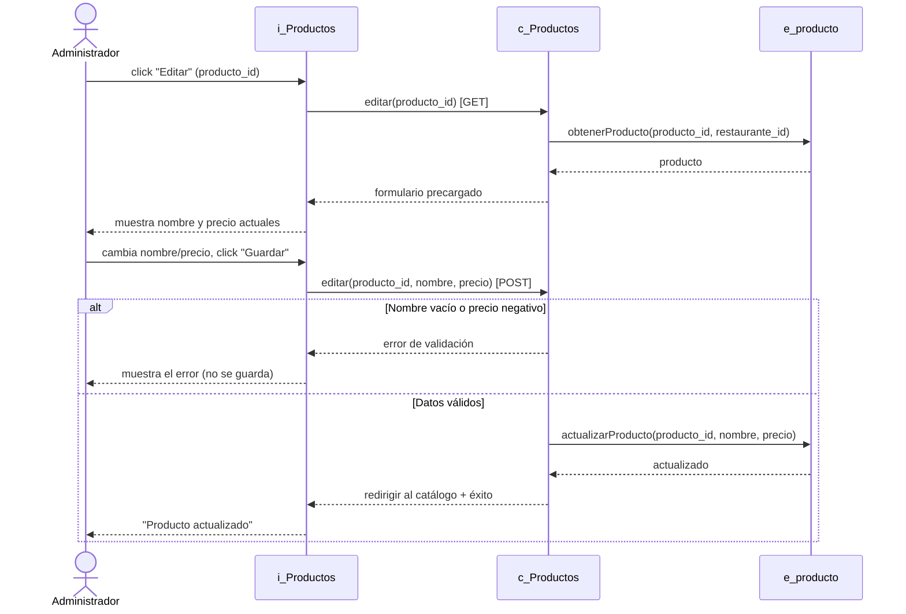
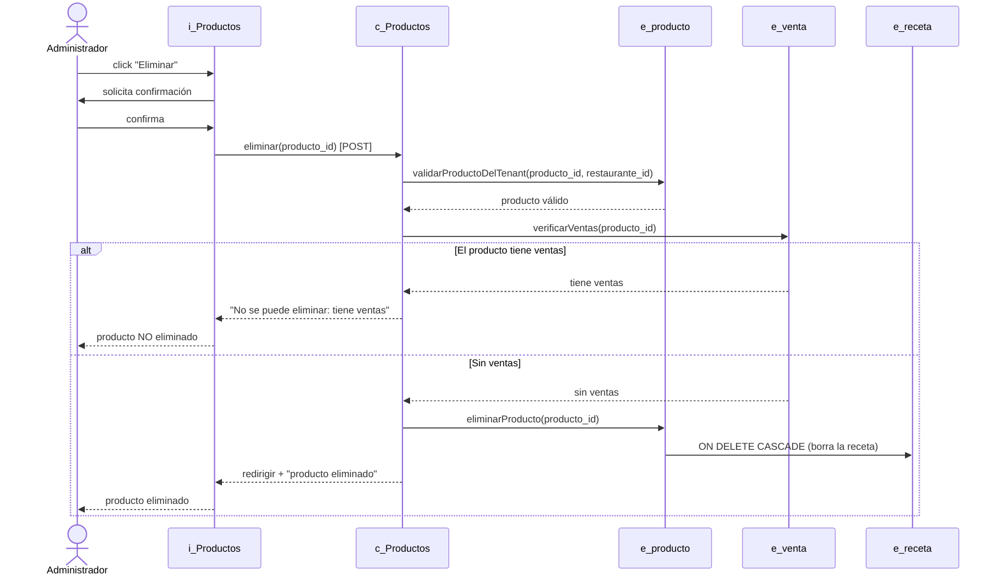
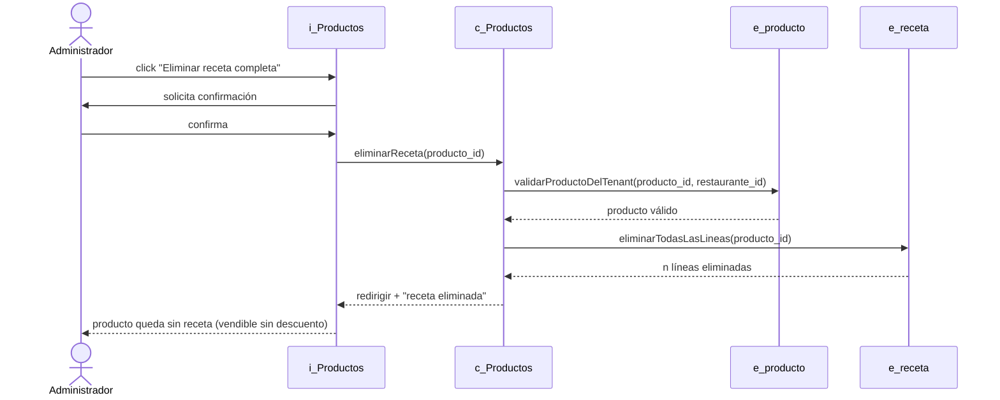
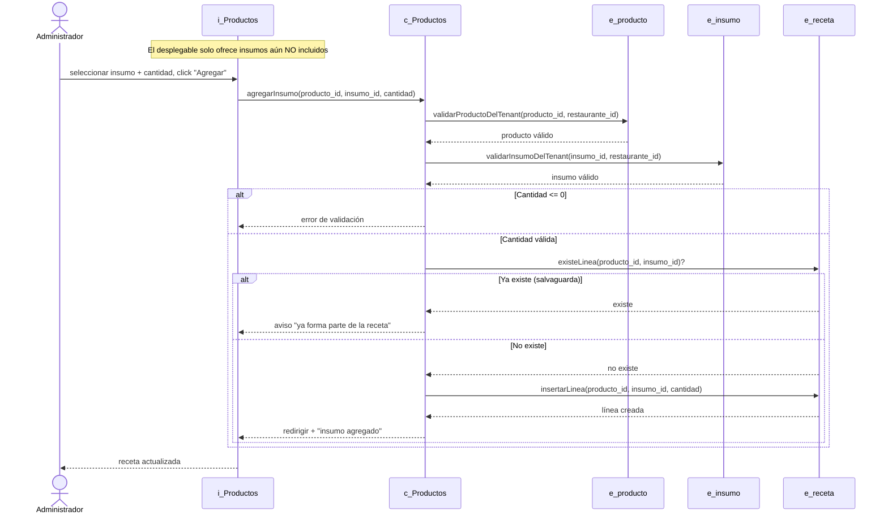
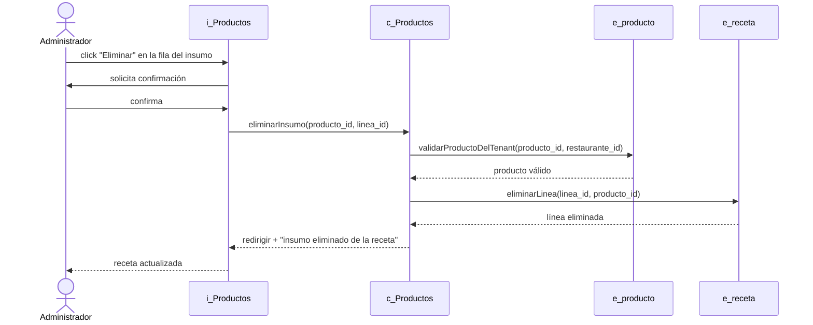
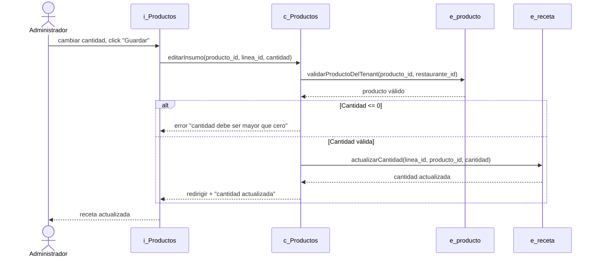

# Diagramas de secuencia — Módulo Productos

Diagramas de secuencia de los casos de uso del módulo de Productos y de la
gestión de recetas, basados en la implementación real (`app/routes/productos.py`).
Se usa la convención boundary-control-entity de los demás diagramas del proyecto:

- **`i_`** interfaz (boundary): la vista con la que interactúa el usuario.
- **`c_`** control: el blueprint/controlador de productos.
- **`e_`** entidad: las tablas de la base (`productos`, `recetas`, `insumos`,
  `ventas`/`detalle_ventas`).

> Estos diagramas se renderizan automáticamente en GitHub. Para el informe puedes
> exportarlos a imagen desde <https://mermaid.live> (pega el bloque `mermaid`).

---

## CU-22 — Listar Productos

---

## CU-23 — Agregar Producto

---

## CU-24 — Editar Producto

---

## CU-25 — Eliminar Producto

---

## CU-08 — Eliminar Receta

---

## CU-10 — Agregar Insumo a Receta

---

## CU-11 — Eliminar Insumo de Receta

---

## CU-12 — Editar Insumo de Receta

