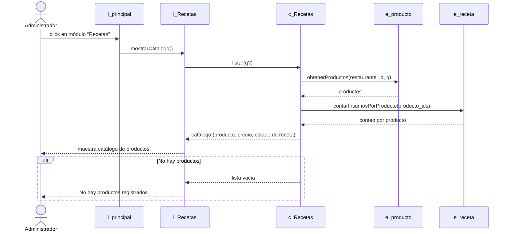
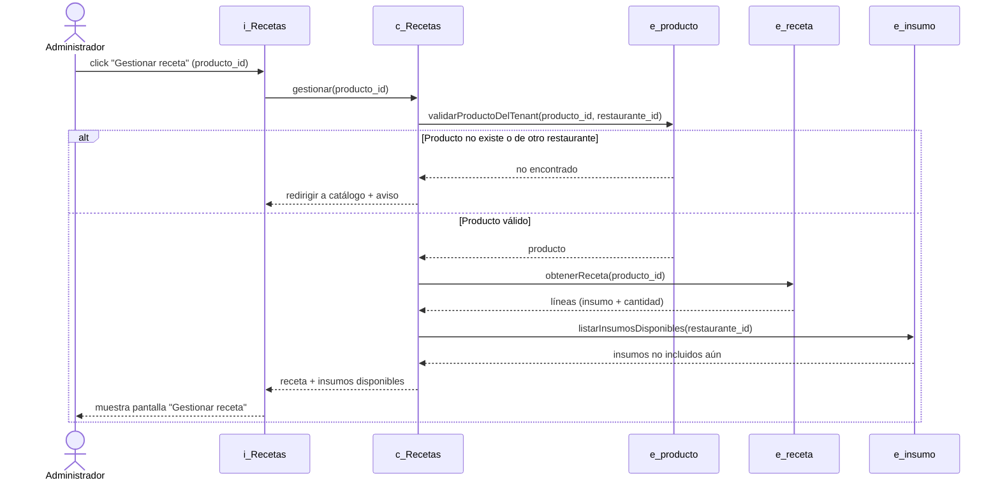
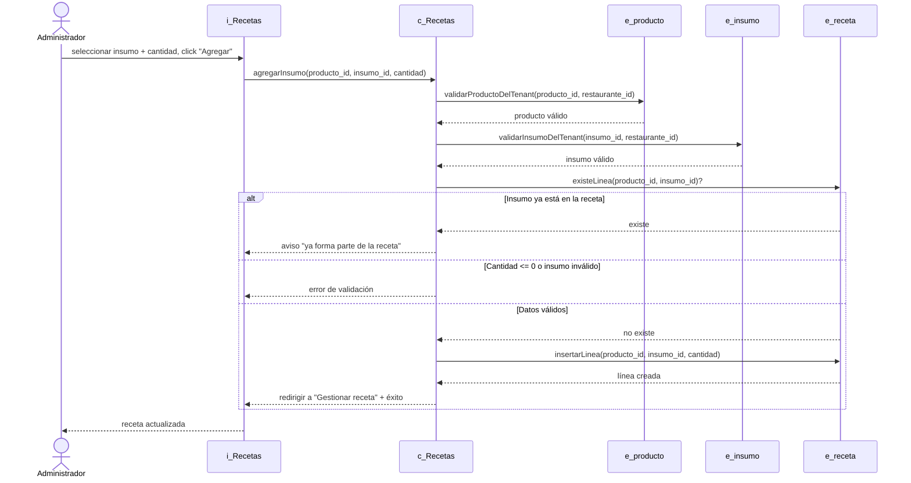
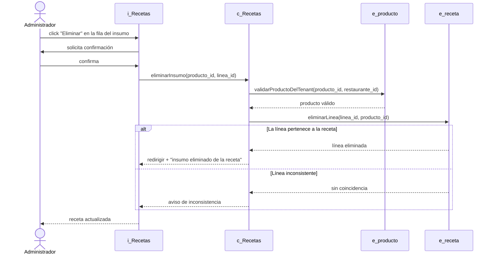
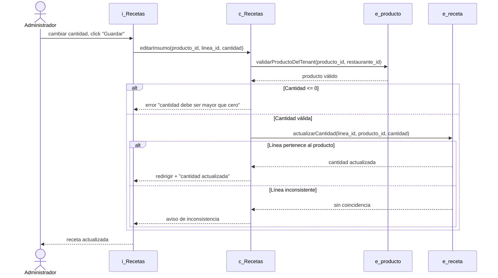
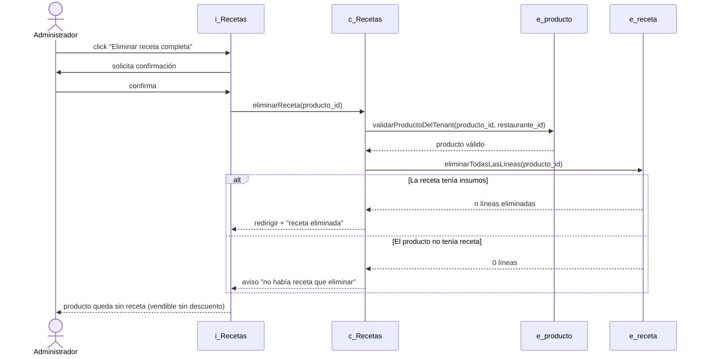

# Diagramas de secuencia — Módulo Recetas

Diagramas de secuencia de los casos de uso del módulo de Recetas, basados en la
implementación real (`app/routes/recetas.py`). Se usa la convención
boundary-control-entity de los demás diagramas del proyecto:

- **`i_`** interfaz (boundary): la vista con la que interactúa el usuario.
- **`c_`** control: el blueprint/controlador de recetas.
- **`e_`** entidad: las tablas de la base (`productos`, `recetas`, `insumos`).

> Estos diagramas se renderizan automáticamente en GitHub. Para el informe puedes
> exportarlos a imagen desde <https://mermaid.live> (pega el bloque `mermaid`).

---

## CU-06 — Listar Recetas (= CU-22 Listar Productos)

---

## CU-07 — Gestionar Receta (contenedor de CU-08/10/11/12)

Carga de la pantalla única desde la que se realizan las operaciones sobre la
receta. No es un CU aparte: "Agregar receta" se cubre con CU-10 y "Editar
receta" con CU-12; aquí solo se muestra la carga de la pantalla.

---

## CU-10 — Agregar Insumo a Receta

---

## CU-11 — Eliminar Insumo de Receta

---

## CU-12 — Editar Insumo de Receta

---

## CU-08 — Eliminar Receta

