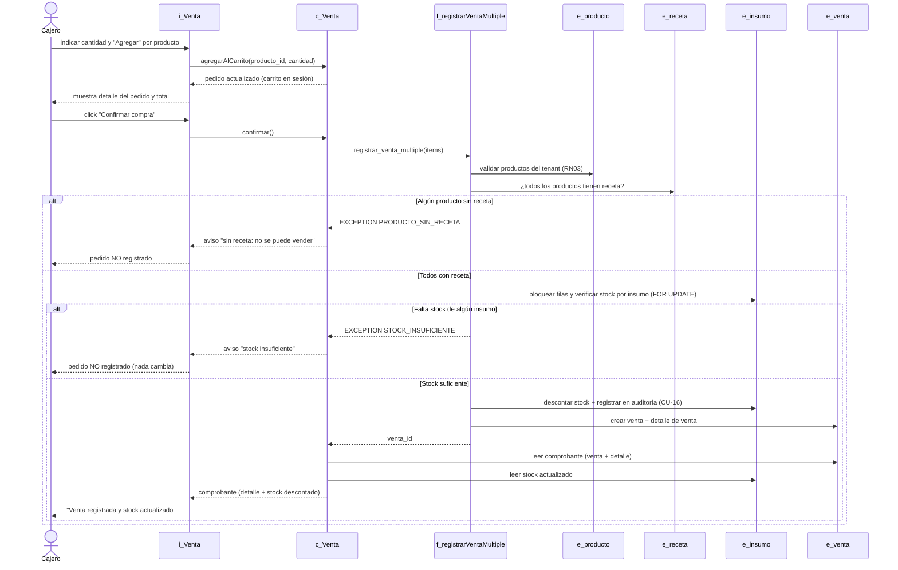

# Diagramas de secuencia — Módulo Ventas

Diagrama de secuencia del caso de uso de venta, basado en la implementación real
(`app/routes/ventas.py` + la RPC `registrar_venta_multiple`, migración 010).
Convención boundary-control-entity, como el resto de los diagramas:

- **`i_`** interfaz (boundary): la pantalla de venta.
- **`c_`** control: el blueprint/controlador de ventas.
- **`f_`** función de base de datos (RPC transaccional).
- **`e_`** entidad: las tablas de la base.

> Se renderiza automáticamente en GitHub. Para el informe puedes exportarlo a
> imagen desde <https://mermaid.live>.

---

## CU-15 — Registrar Venta (carrito + auto-descuento)

La venta **exige** que todos los productos tengan receta (regla reforzada en la
migración 010): un producto sin receta bloquea el pedido completo. Todo el
descuento ocurre dentro de la RPC transaccional; si algo falla, no se registra
nada (RNF-REL-01). Incluye el auto-descuento de stock (CU-16).

---

## Notas

- **Atomicidad (RNF-REL-01):** toda la operación (validaciones, descuento,
  inserción de venta/detalle y auditoría) corre dentro de la RPC en una sola
  transacción. Cualquier excepción revierte el pedido completo: nunca queda media
  venta ni un inventario descuadrado.
- **CU-16 (Auto-descuento):** no es una pantalla, ocurre dentro de este mismo
  flujo (paso "descontar stock + registrar en auditoría").
- **Sin escape:** ya no existe el "continuar de todos modos"; un producto sin
  receta siempre bloquea la venta.
